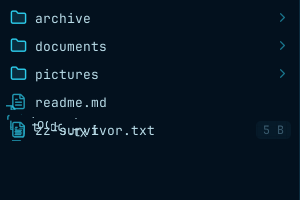
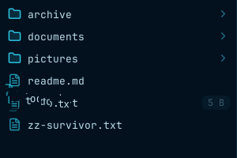
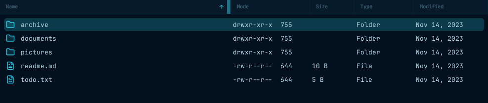
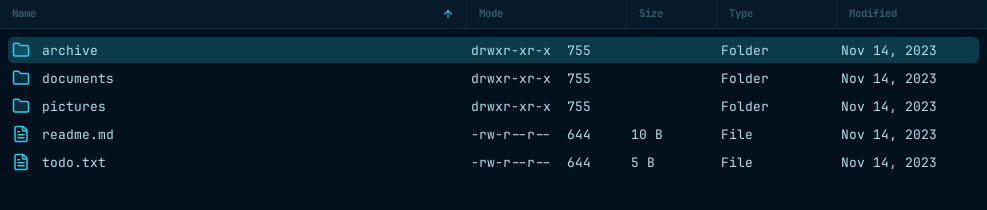
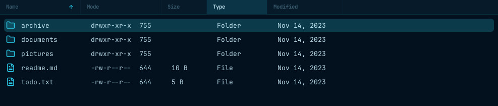
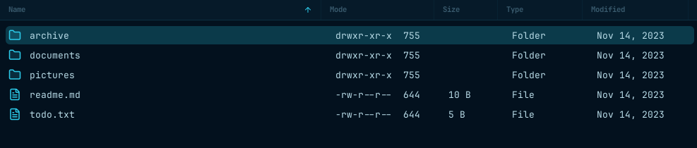

# Delete animation and column resizing (#928)

The owner explicitly requested the deletion, resizing, and resize-indicator fixes
in one PR. No validation requirements were waived.

## Visual evidence

These crops use synthetic fixtures on private Xvfb/D-Bus sessions through the
canonical pinned E2E container. The before build is `f54043d7`; the after build
contains this change. No owner recordings or private filenames were uploaded.
The one-off capture plugin lives outside the test suite in ignored `target/`.

### Permanent deletion, during the dissolve

Before, `zz-survivor.txt` moves into the disappearing item's fragments. After,
it remains below the animation until the updated layout is revealed.

| Before | After |
| --- | --- |
|  |  |

### Hovering the Name resize handle

The filled accent rectangle is removed; the resize cursor and grab area remain.




### Dragging the Name divider 12 pixels left

Before, the column snaps to its minimum width. After, it shrinks by 12 pixels.




## Validation

Scope is bounded to permanent-delete presentation, list header drag origins, and
resize-handle styling. Deletion I/O and model reconciliation are unchanged.
Coverage includes all three delete presentations, cancellation/reduced-motion
snapshot cleanup, pointer shielding for frozen rows, progress dismissal/empty-state ordering, all five list headers,
and both horizontally constrained and expanded header layouts.

From the issue worktree:

```sh
./scripts/test-headless.py ui::browser::dissolve_delete::tests
./scripts/test-headless.py ui::browser::events::tests
./scripts/test-headless.py ui::browser_modes::tests::column_widths
./scripts/test-headless.py ui::browser::trash::tests
STRATA_CONTAINER_ENGINE=podman ./scripts/e2e.sh \
  tests/e2e/scenarios/test_drag_animation.py \
  tests/e2e/scenarios/test_entry_management.py \
  tests/e2e/scenarios/test_view_switching.py \
  -k 'delete or list_column_resize'
STRATA_CONTAINER_ENGINE=podman ./scripts/quality.sh fmt
STRATA_CONTAINER_ENGINE=podman ./scripts/quality.sh clippy
git diff --check
```

Results: 6, 10, 2, and 9 Rust tests passed (27 total); 11 E2E tests passed;
formatting, Clippy, and whitespace checks passed. Container commands used a
session-owned rootless Podman wrapper on `PATH`, with isolated storage/runtime
and the verified published base (inputs `5925f771d203e87856087897ef37ecb6b989b9662abf2526d91b3ec31b1b3913`).

The new header-origin Rust regression failed on the original implementation
(Mode jumped from 160 to 80). The animated-delete and real-pointer resize E2E
regressions both failed against the original implementation and passed after the
fix. Screenshot capture reruns also passed on fixed builds.

Full Rust/E2E suites were intentionally omitted in favor of this targeted
behavior/caller coverage. CI remains authoritative; its required checks must
pass before merge. No installed desktop build or owner session was modified.
